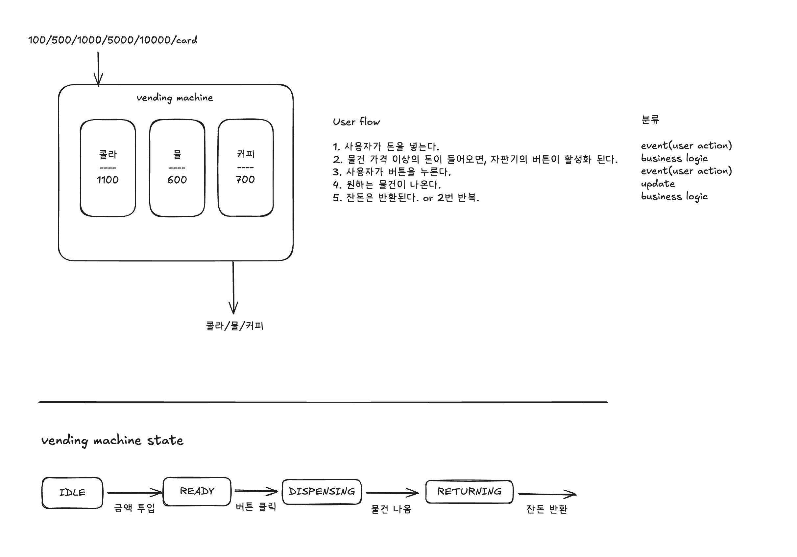
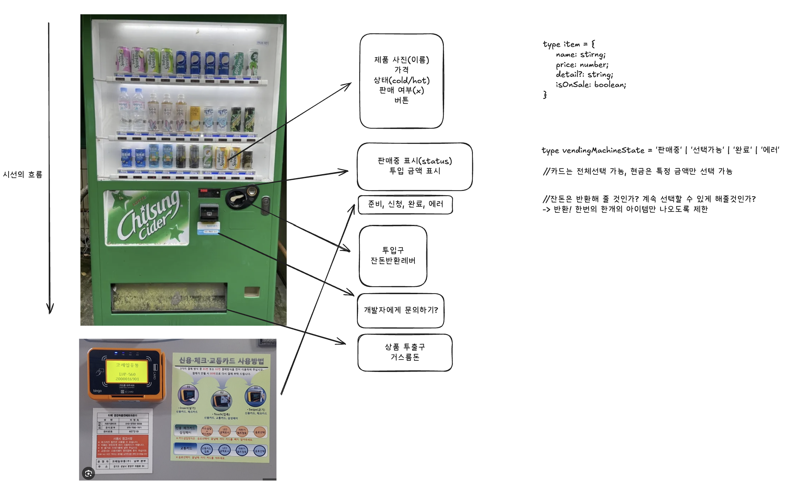

# Vending Machine

자판기의 동작 흐름을 분석해 구현한 웹 자판기 애플리케이션입니다.

## 1. 사전준비 (자판기 동작 흐름 도식화)

### 사용자 플로우 다이어그램

<p align="center">
  
</p>

자판기 사용의 전체 과정을 간단히 시각화한 플로우 차트입니다.
함수처럼 Input, Output이 있는 구조를 생각해보았고, 핵심 userflow를 작성했습니다.
또한 해당 플로우가 개발의 어느 단계에 있는지 생각했습니다.
가장 중요한 자판기의 상태도 고민해 보았습니다.

### 실제 자판기로부터 타입 도출

<p align="center">
  
</p>

실제 자판기 이미지를 가지고 어떤 컴포넌트들이 필요할지를 분석해보았습니다.

카드 결제의 여부, 잔돈 반환 등 중요 비즈니스 로직들을 미리 고민했고, 개발 방향성을 잡았습니다.

### 디자인 레퍼런스 참고

<p align="center">
  
</p>
[Amura Vending Machine UI](https://dribbble.com/shots/17321287-Amura-Vending-Machine-UI-UX-Design)

자판기의 특성을 놓치지 않으면서도 UI 친화적인 구성을 참고해서 스타일링 진행했습니다.

## 2. 개발 과정

## 진행 순서

1. 타입 작성
2. 비즈니스 로직 tdd로 작성
3. UI 컴포넌트 구현
4. 스타일링 및 theme 공통화
5. 전체 context API 상태관리
6. 에러처리 로딩상태 등 디테일 추가
   위와 같은 단계로 개발 잔행했습니다.

### 요구사항

- **Node.js**: v20.19.2
- **npm**: 11.4.0

## 기술 스택

| 분류                  | 기술            | 버전      |
| --------------------- | --------------- | --------- |
| **언어**              | TypeScript      | ~5.6.2    |
| **프레임워크**        | React           | ^18.3.1   |
| **스타일링**          | Emotion         | ^11.14.0  |
| **애니메이션**        | Framer Motion   | ^12.23.24 |
| **테스트**            | Vitest          | ^4.0.6    |
| **테스트 라이브러리** | Testing Library | ^16.3.0   |
| **빌드 도구**         | Vite            | ^6.0.5    |

- 스타일링 도구로 MUI, shardcn, emotion 중 자유로우면서도 패키지 용량이 가벼운 emotion을 선택, framer-motion은 AI와 함께 활용.
- CRA의 deprecated로 인한 vite 사용, vite와 호환성이 좋은 vitest로 tdd 방식 으로 구현

### 설치 및 실행

```bash
npm install
npm run dev
npm test
npm run build
```

## 주요 기능

### 1. 결제 시스템

- **현금 결제**: 100원, 500원, 1,000원, 5,000원, 10,000원 단위 투입
- **카드 결제**: 원하는 상품 어떤것이든 구매가능
- **결제 선택**: 카드 결제 클릭 시, 현금 결제는 불가, 반대도 성립
- **잔액 관리**: 실시간 잔액 표시

### 2. 상품 선택 및 구매

- **상품 목록**: 콜라(1,100원), 물(600원), 커피(700원)
- **재고 관리**: 품절 시 구매 불가 처리
- **구매 검증**: 잔액 확인 및 구매 가능 여부 판단

### 3. 거스름돈 계산

- **Greedy Algorithm**: 최소 화폐 개수로 거스름돈 계산
- **화폐 단위별 분배**: 10,000원부터 100원까지 자동 분배
- **시각적 피드백**: 화폐 단위별 개수 표시

### 4. 예외 처리

- **잔액 부족**: 명확한 에러 메시지 표시
- **재고 부족**: 품절 상품 비활성화 및 알림
- **유효성 검증**: 잘못된 입력값 차단
- **상태 복구**: 에러 발생 시 안전한 상태 복구


## 주요 의사결정

### 1. 상태 관리: Context API 선택

- **이유**: 전역 상태가 적고(balance, selectedProduct, state, error) 단순한 구조
- **대안 고려**: 외부 상태관리 라이브러리는 필요없다고 판단
- **최적화**: products는 추후 API연동을 고려하여 constants에서 가져오고, change는 파생 상태로 처리

### 2. 재고 관리 전략

- **현재**: constants.ts에서 초기 재고 정의
- **향후 확장**: 서버 API 연동 시 쉽게 분리 가능하도록 설계
- **Context에서 제외**: 불필요한 전역 상태 최소화

### 3. 스타일링: Emotion 선택
-  **디자인 시스템** 사용: [STYLING_RULES.md](./STYLING_RULES.md)를 활용하여 AI에게 사용 


### 4.AI활용 
- [TDD 작업 계획서](./TDD_PLAN.md)
- [스타일링 규칙](./STYLING_RULES.md)


## 핵심 구현 사항

### 1. TypeScript 타입 안전성

```typescript
// Literal Type으로 허용된 화폐 단위만 사용 가능
type CashAmount = 100 | 500 | 1000 | 5000 | 10000;

// Discriminated Union으로 결제 수단 구분
type PaymentMethod =
  | { type: "cash"; amount: CashAmount }
  | { type: "card"; amount: number };
```

### 2. 커스텀 에러 클래스

```typescript
class InsufficientBalanceError extends Error {
  constructor(required: number, current: number) {
    super(`잔액이 부족합니다. 필요: ${required}원, 현재: ${current}원`);
    this.name = "InsufficientBalanceError";
  }
}
```

### 3. Greedy Algorithm 거스름돈 계산

```typescript
export function calculateChange(amount: number): ChangeBreakdown {
  const result: ChangeBreakdown = {};
  let remaining = amount;

  for (const unit of CASH_UNITS) {
    // [10000, 5000, 1000, 500, 100]
    const count = Math.floor(remaining / unit);
    result[unit] = count;
    remaining = remaining % unit;
  }

  return result;
}
```